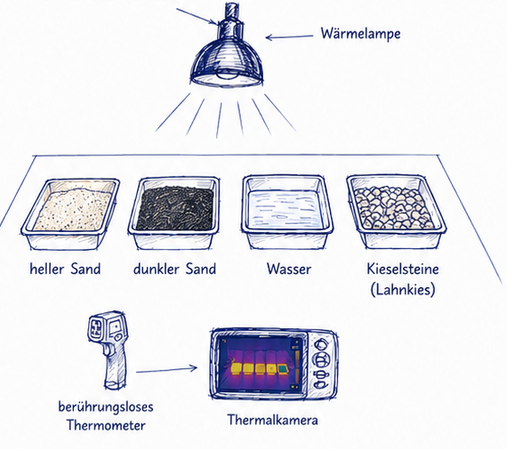

# Strahlungsexperiment: Was wird am heissesten?

::: question-box
**Teamname:**
:::

::: {.callout-tip appearance="minimal"}
Draussen fuehlen sich Oberflaechen oft sehr unterschiedlich warm an. Heller Sand, dunkler Sand, Wasser und Kieselsteine reagieren nicht gleich auf Strahlung.

Ihr testet vier Oberflaechen unter einer Waermelampe. Gemessen wird mit einer Thermalkamera und einem beruehrungslosen Thermometer.

Der dunkle Sand ist ein deutliches Beispiel: An ihm kann man gut erkennen, was dunkle Oberflaechen mit Strahlung machen.
:::

# Die Frage

Welche Oberflaeche wird unter gleicher Bestrahlung am heissesten?

Schaut euch die Materialien kurz an. Achtet auf Farbe, Feuchtigkeit und Material: Heller Sand, dunkler Sand, Wasser und Kieselsteine nehmen Strahlung nicht auf die gleiche Weise auf.

Gebt vor dem Messen einen Tipp ab.

::: answer-box-medium
**Unser Tipp:**
:::

Warum glaubt ihr das?

::: answer-box
**Unsere Begruendung vor dem Messen:**
:::

# Der Versuch

Es gibt vier flache Schalen:

- heller Sand
- dunkler Sand
- Wasser
- Kieselsteine / Lahnkies

Alle Schalen stehen gleich weit von der Waermelampe entfernt. Die Lampe bleibt waehrend des Versuchs an derselben Stelle. Ihr messt immer von oben auf die Oberflaeche.

::: {.callout-note appearance="minimal"}
Nicht in die helle Lampe schauen. Die Lampe nicht anfassen.
:::

# Messen

Messt zuerst die Temperatur ohne Waermelampe.

Schaltet dann die Waermelampe ein. Messt nach 3, 6, 9 und 12 Minuten.

Nutzt das beruehrungslose Thermometer fuer die Zahlenwerte. Nutzt die Thermalkamera, um die Temperaturunterschiede sichtbar zu machen.

| Zeit | heller Sand | dunkler Sand | Wasser | Kieselsteine |
|---|---:|---:|---:|---:|
| 0 min |  |  |  |  |
| 3 min |  |  |  |  |
| 6 min |  |  |  |  |
| 9 min |  |  |  |  |
| 12 min |  |  |  |  |

# Ergebnis

Schaut nach 12 Minuten auf eure Messwerte und auf das Thermalbild.

::: answer-box-medium
**Am heissesten wurde:**
:::

::: answer-box-medium
**Am kuehlsten blieb:**
:::

::: answer-box
**Das war im Thermalbild besonders auffaellig:**
:::

# Auswertung

Vergleicht euren Tipp mit den Messwerten.

::: answer-box
**Unser Tipp war richtig / falsch, weil:**
:::

Versucht nun zu begruenden, warum die Oberflaechen unterschiedlich warm wurden. Nutzt dafuer eure Beobachtungen zu Farbe, Wasser und Material.

::: answer-box
**Unsere Erklaerung:**

Die Oberflaeche ______________________________ wurde besonders warm, weil sie wahrscheinlich ______________________________.

Die Oberflaeche ______________________________ blieb eher kuehl, weil sie wahrscheinlich ______________________________.

Auffaellig war ausserdem:
:::

# Realwelt

Solche Unterschiede kann man draussen an vielen Orten bemerken: auf Wegen, an Straenden, an Ufern, auf Kiesflaechen, auf Parkplaetzen oder an Pfuetzen.

Dunkle Oberflaechen werden in der Sonne oft deutlich waermer als helle Oberflaechen. Wasser erwaermt sich anders als Sand oder Stein, weil es Waerme staerker aufnimmt, verteilt und speichert.

::: answer-box
**Ein Ort draussen, an dem man so einen Temperaturunterschied merken koennte:**
:::

# Ergebnis

::: answer-box

In unserem Versuch wurde ______________________________ am heissesten.

Am kuehlsten blieb ______________________________.

Unter gleicher Strahlung werden Oberflaechen unterschiedlich warm, weil ______________________________.
:::