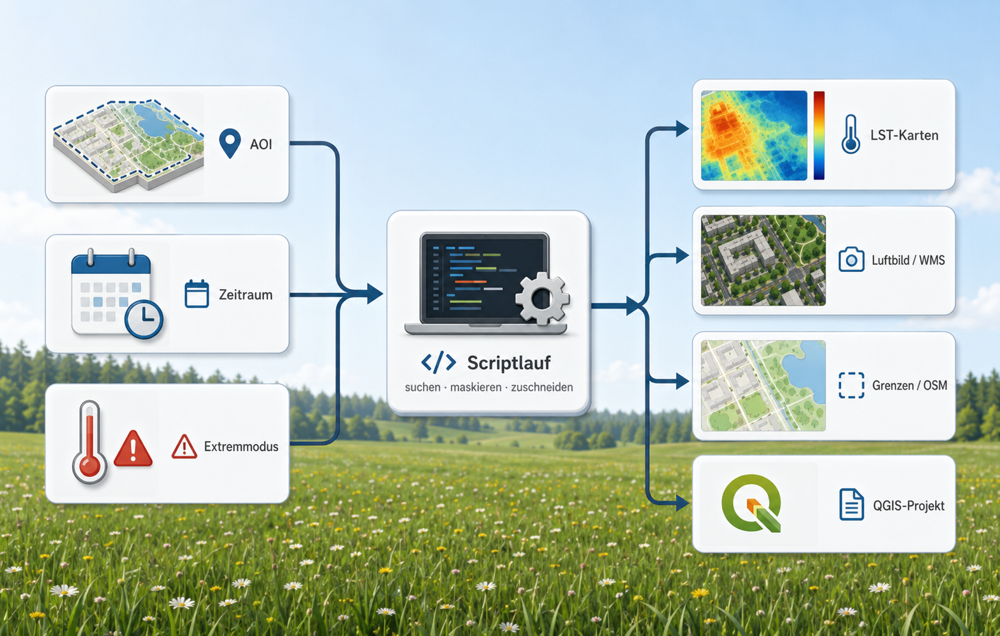
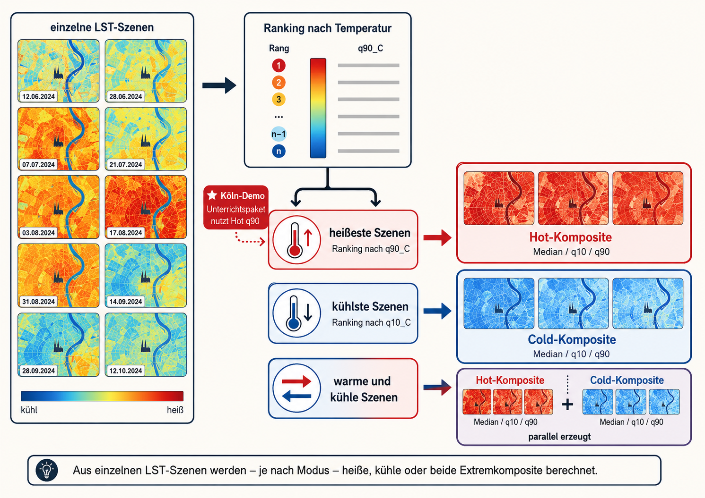
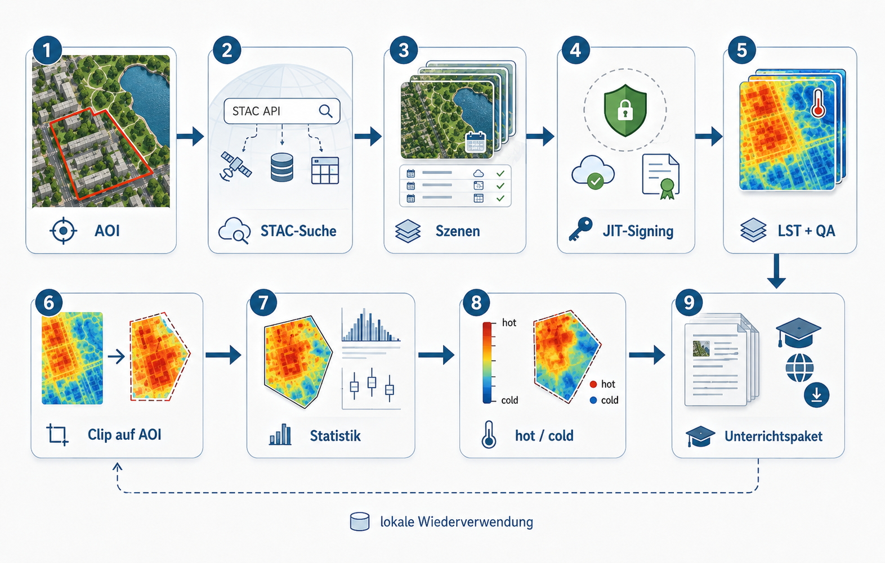

# Zweck der technischen Seite

Diese Seite dokumentiert die lokale Materialproduktion für das Köln-Demo-Paket. Sie richtet sich an Personen, die die Datenprodukte, das QGIS-Projekt und die Drucklayouts neu erzeugen, prüfen oder für einen anderen Ausschnitt anpassen wollen.

Der Workflow erzeugt aus einem Untersuchungsgebiet, einem Zeitraum und einer DOP-CIR-basierten Oberflächenmaske ein QGIS-Projekt mit passgenauen Drucklayouts. Die Skripte erzeugen das Material. Im Unterricht liegen anschließend fertige Karten, Folien und Beobachtungsaufgaben vor.

{fig-align="center" width="95%"}

# Lokaler Windows-Workflow

Diese Seite beschreibt die lokale Windows-Produktion des Köln-Demo-Pakets. R erzeugt die Datenprodukte, QGIS erzeugt Projektdatei und Drucklayouts. Für die Unterrichtsdurchführung selbst werden anschließend nur die fertigen PDF-/PNG-Ausgaben benötigt.

Für das Windows-Setup gibt es drei konkrete Skriptebenen:

1. `00_run_lst_oberflaechenmaske_dop_cir.R` ist der zentrale Einstieg.
2. `landsat_lst_mit_dop_cir_oberflaechenmaske.R` erzeugt AOI, Landsat-LST-Produkte, Extremkomposite und Teaching-Layer.
3. `create_qgis_project.py` erzeugt danach das QGIS-Projekt, Layerstyling und die Drucklayouts.

Der `00`-Runner ruft am Ende den QGIS-Launcher auf. Unter Windows ist das `scripts/run_create_qgis_project.bat`; unter Linux wäre es `scripts/run_create_qgis_project.sh`.


# Windows-Arbeitsumgebung

Für den technischen Workflow reicht unter Windows eine lokale Installation aus R, QGIS und optional Quarto/RStudio. Für den QGIS-Teil wird die Python-Umgebung der QGIS-Installation verwendet. PyQGIS kommt mit QGIS beziehungsweise OSGeo4W. Das Projekt startet QGIS deshalb über `run_create_qgis_project.bat`.

Benötigt werden konkret:

| Komponente | Zweck im Workflow | Installation unter Windows |
|---|---|---|
| R | startet den zentralen Workflow, sucht Landsat-Szenen, berechnet LST-Produkte, erzeugt DOP-CIR-Maske und Teaching-Layer | CRAN-Windows-Installer installieren |
| RStudio Desktop | optional, aber praktisch zum Bearbeiten und Starten der R-Skripte | Posit/RStudio-Installer installieren |
| QGIS LTR oder QGIS 3.x | erzeugt QGIS-Projekt, Layerstyling, Layouts und PDF/PNG-Printprodukte | QGIS-Standalone oder OSGeo4W installieren |
| QGIS-Python / PyQGIS | wird von `create_qgis_project.py` genutzt | kommt mit QGIS, nicht separat installieren |
| GDAL/OGR | Raster-/Vektorunterstützung für QGIS und viele Geodatenformate | kommt mit QGIS/OSGeo4W; R nutzt zusätzlich eigene Paketabhängigkeiten |
| Quarto | nur für das Rendern dieser Webseiten/Dokumentation nötig, nicht für die Materialerzeugung | Quarto-Windows-Installer installieren |
| Git | Versionsverwaltung der Skripte und Quarto-Seiten | Git for Windows installieren |

Für R müssen die verwendeten Pakete verfügbar sein. Der Workflow installiert fehlende R-Pakete teilweise selbst, trotzdem ist ein einmaliger Test sinnvoll:

```r
install.packages(c(
  "sf", "terra", "rstac", "dplyr", "purrr",
  "tibble", "readr", "jsonlite", "png", "here"
))
```

Falls Windows beim Kompilieren einzelner R-Pakete scheitert, ist Rtools passend zur installierten R-Version nachzuinstallieren. Für die normalen CRAN-Binaries ist Rtools meist nicht nötig, für Pakete aus Quellcode aber schon.

Der empfohlene Windows-Start ist:

```bat
Rscript scripts\00_run_lst_oberflaechenmaske_dop_cir.R
```

Wenn QGIS nicht automatisch gefunden wird, wird der Pfad vor dem Start gesetzt:

```bat
set QGIS_BIN=C:\Program Files\QGIS 3.34.4\bin\qgis-bin.exe
Rscript scripts\00_run_lst_oberflaechenmaske_dop_cir.R
```

Bei OSGeo4W kann der Pfad stattdessen so aussehen:

```bat
set QGIS_BIN=C:\OSGeo4W\bin\qgis-ltr-bin.exe
Rscript scripts\00_run_lst_oberflaechenmaske_dop_cir.R
```

Die BAT-Datei setzt für QGIS zwei Variablen, die das Python-Skript zwingend benötigt:

```bat
set QGIS_SCRIPT_DIR=...
set PROJECT_ROOT=...
```

Diese Konstruktion ist nötig, weil QGIS `--code` den Python-Code intern mit `exec(f.read())` ausführt. In diesem Ausführungsmodus ist `__file__` nicht definiert. Das Skript darf seine Pfade deshalb nicht über `Path(__file__)` ableiten.


# Projektstruktur

Die Skripte erwarten diese Grundstruktur:

```text
project_root/
├── scripts/
│   ├── 00_run_lst_oberflaechenmaske_dop_cir.R
│   ├── landsat_lst_mit_dop_cir_oberflaechenmaske.R
│   ├── dop_cir_oberflaechenmaske_modul.R
│   ├── create_qgis_project.py
│   ├── run_create_qgis_project.sh
│   └── run_create_qgis_project.bat
└── data/
    └── landsat_lst/
        └── koeln/
```

Für das Untersuchungsgebiet `koeln` werden die erzeugten Daten unterhalb von `data/landsat_lst/koeln/` abgelegt:

```text
data/landsat_lst/koeln/
├── 01_aoi/
├── 02_stac/
├── 03_landsat_scenes/
├── 04_extremes/
├── 05_teaching_layers/
│   ├── projected_lst/
│   └── dop_cir_surface_mask/
├── 06_qgis_project/
│   └── print_exports/
└── 99_logs/
```

Wichtig für das Unterrichtspaket sind vor allem:

```text
05_teaching_layers/projected_lst/koeln_LST_hot_q90_C_EPSG25832.tif
05_teaching_layers/dop_cir_surface_mask/koeln_dop_cir_30m_3klassen.gpkg
06_qgis_project/koeln_lst_oberflaechenmaske.qgz
06_qgis_project/print_exports/
```

# Zentrale Parameter im 00-Runner

Die wichtigsten Einstellungen stehen im Einstiegsskript `00_run_lst_oberflaechenmaske_dop_cir.R`. Für die Köln-Demo ist der Workflow auf hot-LST und DOP-CIR-Oberflächenmaske ausgerichtet:

```r
aoi_name <- "koeln"
aoi_mode <- "koeln_stadtbezirke"

date_start <- "2023-01-01"
date_end   <- "2026-01-01"

seasonal_months <- 6:8
extreme_mode <- "hot"
hot_metric <- "q90_C"
n_hot <- 10

crs_qgis <- 25832
crs_lucc <- 3035

aerial_source_mode <- "both"
run_qgis_project_creation <- FALSE
```

`run_qgis_project_creation <- FALSE` verhindert einen älteren internen QGIS-Projektaufruf. Das QGIS-Projekt wird stattdessen am Ende des `00`-Runners über den separaten Launcher erzeugt. Dadurch bleibt die QGIS-Layoutlogik im PyQGIS-Skript und wird nicht mit der Landsat-Verarbeitung vermischt.

# DOP-CIR-Oberflächenmaske

Die Oberflächenmaske wird aus dem DOP-CIR-WMS NRW erzeugt. Sie dient als didaktische Grobmaske für drei Oberflächenklassen:

```text
1 Vegetation
2 Wasser
3 Versiegelung / Bebauung
```

Die Maske dient als robuste Unterrichtsvereinfachung für den Vergleich sichtbarer Oberflächen mit LST-Mustern. Grundlage ist ein DOP-CIR-Bild, das als RGB-Bild über den WMS geladen wird. Die Klassifikation nutzt eine restitutierte RGB-/Excess-Logik, keine HSV-Klassifikation.

Der WMS-Zugriff erfolgt über:

```text
https://www.wms.nrw.de/geobasis/wms_nw_dop?language=ger
Layer: nw_dop_cir
CRS: EPSG:25832
```

Die erzeugte Maske verwendet 30 m Zielauflösung und passt damit zur Landsat-LST-Maßstabsebene. Danach folgen optional Majority-Filter, klassenspezifische Sieve-Filter für Wasser und Vegetation sowie eine kartographische Vektorglättung. Diese Schritte betreffen die Maske, nicht das RGB-DOP für die Orientierung.

Die drei Klassen sind fachlich so gedacht:

| Klasse | Bedeutung im Unterricht | Erwartete thermische Tendenz |
|---|---|---|
| Vegetation | Parks, Bäume, Wiesen, Grünzüge, begrünte Innenhöfe | häufig kühler durch Schatten und Verdunstung |
| Wasser | Rhein, Hafenbecken, Weiher, Teiche | häufig kühler bzw. thermisch träger |
| Versiegelung / Bebauung | Straßen, Plätze, Dächer, Bahnanlagen, Gewerbe, Parkplätze | häufig wärmer durch geringe Verdunstung und Wärmespeicherung |

Offene Böden, Schotter, Baustellen oder trockene Brachen gelten als Grenzfälle und können im Unterrichtsgespräch ergänzend thematisiert werden.

# Landsat-LST-Verarbeitung

Die Landsat-Szenen werden über den Planetary Computer STAC gesucht. Verwendet werden Landsat 8 und Landsat 9, Level-2-Produkte mit thermischem Band und QA-Pixel-Band. Aus dem thermischen Band wird LST in Grad Celsius berechnet. Ungültige Pixel, Wolken, Wolkenschatten, Cirrus und weitere QA-Probleme werden maskiert.

Der Workflow erzeugt zunächst einzelne lokale LST-Szenen und berechnet danach Extremkomposite. Für die Köln-Demo steht der hot-Modus im Zentrum. Es werden die heißesten Szenen nach `q90_C` ausgewählt und daraus Komposite berechnet.

{fig-align="center" width="95%"}

Das aktuelle QGIS-Projekt verwendet das zentrale Hot-q90-Produkt:

```text
koeln_LST_hot_q90_C_EPSG25832.tif
```

Dieses Produkt zeigt die robuste obere Temperaturtendenz der ausgewählten heißen Szenen und eignet sich für den Vergleich mit Stadtstruktur, Vegetation und Wasser.

# QGIS-Projekt und Layerlogik

Das QGIS-Projekt wird durch `scripts/create_qgis_project.py` erzeugt. Weil QGIS `--code` intern per `exec(f.read())` ausführt, wird im Python-Skript nicht mit `__file__` gearbeitet. Der Launcher setzt stattdessen:

```text
QGIS_SCRIPT_DIR
PROJECT_ROOT
```

Die Layerreihenfolge im Projekt ist bewusst reduziert:

```text
oben
  04 Oberflächenmaske Linien
  03 Kartenrahmen
  02 Hot LST q90
  01 DOP RGB
  00 Orientierung
unten
```

Im QGIS-Projekt wird das DOP-RGB als WMS-Layer zur Orientierung geladen. Der LST-q90-Layer liegt darüber und wird im Skript gezielt gestylt. Die Printlayouts werden aus den im Skript definierten Layerlisten aufgebaut; sie sind nicht identisch mit dem gerade sichtbaren Layerzustand im QGIS-Fenster.

Das QGIS-Projekt enthält ausschließlich das q90-Hot-Produkt. Median, q10 und Cold-Produkte bleiben außerhalb des reduzierten Unterrichtsprojekts. Die Projektlogik fokussiert den Zusammenhang zwischen Oberfläche, Stadtstruktur und warmen Oberflächentemperaturen.

# Printlayouts und Export

Das PyQGIS-Skript erzeugt vier Layouts:

```text
Print 01 DOP
Print 02 Hot LST q90
Print 03 Maskenoverlay
Print 04 Rahmen Graticule
```

Die Layouts verwenden denselben Kartenausschnitt und denselben Kartenrahmen. Ausdrucke oder Folien liegen dadurch deckungsgleich übereinander. Die Legenden bleiben bewusst minimal; die Arbeit liegt in der räumlichen Zuordnung.

Die Exportdateien liegen unter:

```text
data/landsat_lst/koeln/06_qgis_project/print_exports/
```

Erzeugt werden:

```text
koeln_print_01_dop.pdf
koeln_print_02_lst_hot_q90.pdf
koeln_print_03_mask_overlay.pdf
koeln_print_04_frame_graticule.pdf
koeln_print_03_mask_overlay_transparent.png
koeln_print_04_frame_graticule_transparent.png
```

Beim Druck muss immer mit tatsächlicher Größe gedruckt werden:

```text
100 %
nicht an Seite anpassen
keine automatische Skalierung
```

Nur dann liegen DOP, LST, Maske und Passfolie deckungsgleich übereinander.

# Kartenausschnitt und Gitternetz

Der Kartenausschnitt wird im Python-Skript über `MAP_EXTENT_25832` gesteuert:

```python
MAP_EXTENT_25832 = (353000.00, 5642500.00, 358500.00, 5647500.00)
```

Die Werte sind Koordinaten in EPSG:25832. Für einen anderen Ausschnitt kann in QGIS der gewünschte Kartenausschnitt eingestellt und dann in der Python-Konsole ausgelesen werden:

```python
e = iface.mapCanvas().extent()
print((e.xMinimum(), e.yMinimum(), e.xMaximum(), e.yMaximum()))
```

Die ausgegebenen vier Werte werden anschließend in `MAP_EXTENT_25832` eingetragen.

Das Gitternetz wird über `GRID_INTERVAL_M` gesteuert:

```python
GRID_INTERVAL_M = 1000
```

Für gröbere Passmarken kann hier z. B. `2000` gesetzt werden. Für die Unterrichtsausdrucke ist ein zu dichtes Gitternetz ungünstig, weil es die Bildinterpretation stören kann. Der Rahmen- und Graticule-Layer dient vor allem dazu, Ausdrucke und Folien exakt auszurichten.

# Windows-Start und Dateiaufrufe

Der zentrale Startpunkt bleibt immer das `00`-Skript:

```bat
Rscript scripts\00_run_lst_oberflaechenmaske_dop_cir.R
```

Dieses Skript lädt zuerst das DOP-CIR-Modul, danach den Landsat-LST-Hauptworkflow und startet am Ende den QGIS-Launcher. Die QGIS-Projekterzeugung wird also nicht separat per Hand aus `data/landsat_lst/koeln/06_qgis_project/` gestartet.

Die relevante Reihenfolge ist:

```text
00_run_lst_oberflaechenmaske_dop_cir.R
→ dop_cir_oberflaechenmaske_modul.R
→ landsat_lst_mit_dop_cir_oberflaechenmaske.R
→ run_create_qgis_project.bat
→ create_qgis_project.py
```

Der Windows-Launcher liegt unter:

```text
scripts/run_create_qgis_project.bat
```

Er startet:

```text
scripts/create_qgis_project.py
```

und nicht alte Skripte aus dem Datenordner. Alte Dateien unter `data/landsat_lst/koeln/06_qgis_project/` sind keine Referenz mehr. Dort liegen nur erzeugte Projekt- und Exportprodukte.

Die BAT-Datei sucht typische QGIS-Installationen. Wenn mehrere QGIS-Versionen installiert sind oder der Pfad abweicht, wird `QGIS_BIN` explizit gesetzt:

```bat
set QGIS_BIN=C:\Program Files\QGIS 3.34.4\bin\qgis-bin.exe
```

oder:

```bat
set QGIS_BIN=C:\OSGeo4W\bin\qgis-ltr-bin.exe
```

Danach wird der Workflow erneut gestartet:

```bat
Rscript scripts\00_run_lst_oberflaechenmaske_dop_cir.R
```

Diesen Aufruf vermeiden:

```bat
python scripts\create_qgis_project.py
```

Normales Python stellt keine PyQGIS-Umgebung bereit. Das QGIS-Projekt wird über `qgis-bin.exe --code` gestartet.

# Technischer Datenfluss

{fig-align="center" width="95%"}

Der technische Ablauf lässt sich so zusammenfassen:

```text
AOI / Köln-Stadtbezirke
→ Landsat-STAC-Suche
→ LST-Szenen in Grad Celsius
→ Auswahl heißer Szenen nach q90_C
→ Hot-LST-Komposite
→ DOP-CIR-Oberflächenmaske
→ Teaching-Layer
→ QGIS-Projekt
→ vier passgleiche Printlayouts
```

Im QGIS-Projekt werden exakt die für das Druckpaket benötigten Layer geladen: DOP-RGB, Hot-LST-q90, DOP-CIR-Maskenlinien und ein Kartenrahmen-Layer. Die Printlayouts greifen diese Layer gezielt ab und schreiben die PDF-/PNG-Dateien in `06_qgis_project/print_exports/`.

# Windows-Fehlerquellen

## QGIS wird nicht gefunden

Wenn der R-Workflow am Ende bei `run_create_qgis_project.bat` abbricht, ist meist `QGIS_BIN` nicht korrekt gesetzt. Dann zuerst prüfen, wo QGIS installiert ist. Typische Pfade sind:

```bat
C:\Program Files\QGIS 3.34.4\bin\qgis-bin.exe
C:\OSGeo4W\bin\qgis-ltr-bin.exe
```

Der Pfad wird vor dem Start gesetzt:

```bat
set QGIS_BIN=C:\Program Files\QGIS 3.34.4\bin\qgis-bin.exe
Rscript scripts\00_run_lst_oberflaechenmaske_dop_cir.R
```

## PyQGIS-Importfehler

Ein Fehler wie `ModuleNotFoundError: No module named 'qgis'` bedeutet: Das Skript wurde mit normalem Python gestartet oder QGIS hat eine falsche Python-Umgebung geerbt. Der Aufruf muss über die BAT-Datei laufen:

```bat
scripts\run_create_qgis_project.bat
```

Nicht über:

```bat
python scripts\create_qgis_project.py
```

Die BAT-Datei leert `PYTHONHOME`, `PYTHONPATH`, `VIRTUAL_ENV`, `RETICULATE_PYTHON` und `RETICULATE_PYTHON_FALLBACK`, damit QGIS seine eigene Python-Umgebung nutzt.

## `__file__` ist nicht definiert

QGIS `--code` setzt kein `__file__`. Die BAT-Datei setzt deshalb:

```bat
QGIS_SCRIPT_DIR
PROJECT_ROOT
```

und das Python-Skript liest genau diese Variablen. `Path(__file__)` darf in diesem Skript nicht verwendet werden.

## R-Pakete fehlen

Der R-Workflow benötigt unter anderem:

```r
sf
terra
rstac
dplyr
purrr
tibble
readr
jsonlite
png
here
```

Fehlende Pakete werden installiert oder müssen manuell installiert werden:

```r
install.packages(c(
  "sf", "terra", "rstac", "dplyr", "purrr",
  "tibble", "readr", "jsonlite", "png", "here"
))
```

Bei Paketinstallationen aus Quellcode wird Rtools passend zur R-Version benötigt. CRAN-Binaries vermeiden diesen Schritt meist.

## Keine oder leere Printprodukte

Zuerst die Eingabedateien prüfen:

```text
data/landsat_lst/koeln/05_teaching_layers/projected_lst/koeln_LST_hot_q90_C_EPSG25832.tif
data/landsat_lst/koeln/05_teaching_layers/dop_cir_surface_mask/koeln_dop_cir_30m_3klassen.gpkg
```

Danach prüfen, ob die Exporte geschrieben wurden:

```text
data/landsat_lst/koeln/06_qgis_project/print_exports/
```

Ein erzeugtes QGIS-Projekt ohne PDFs verweist auf den PyQGIS-Layoutteil als Fehlerort.

## Ausdrucke passen nicht exakt übereinander

Seitenskalierung zerstört die Passgenauigkeit. Alle Ausdrucke müssen mit `100 %` beziehungsweise `tatsächliche Größe` gedruckt werden.

# Kurzfassung

Aktueller technischer Stand:

```text
R-Workflow erzeugt Daten
DOP-CIR-Modul erzeugt 3-Klassen-Oberflächenmaske
QGIS-Python-Skript erzeugt q90-Hot-Projekt
Windows-/QGIS-Launcher erzeugt vier passgenaue Printlayouts
```

Die didaktische Reduktion vergleicht Vegetation, Wasser und versiegelte beziehungsweise bebaute Flächen mit Oberflächentemperaturen. Das technische System macht diese räumliche Beziehung sichtbar und druckbar.
