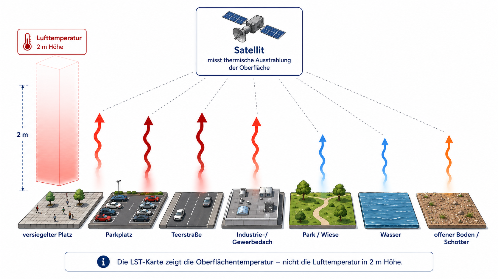
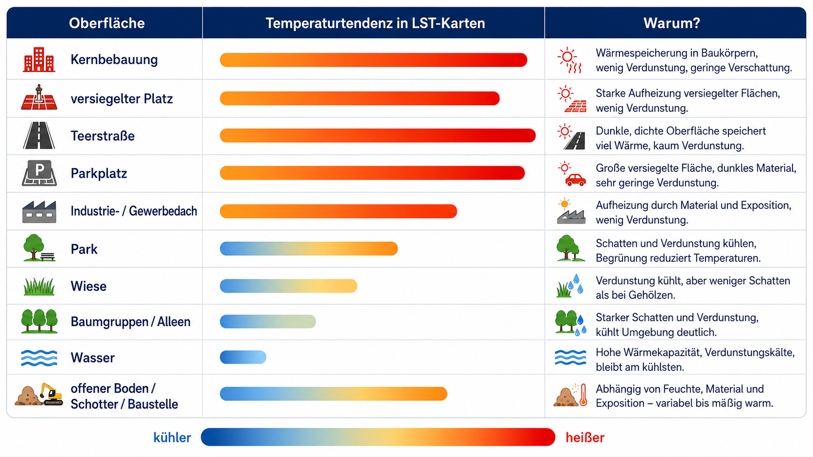

# Stadtflächen und Wärme – was passiert da eigentlich?

::: question-box
**Teamname**
:::

::: {.callout-tip appearance="minimal"}
Wir wissen: Städte bestehen aus sehr unterschiedlichen Oberflächen. Es gibt Asphalt, Dächer, Beton, Wiesen, Bäume, Wasser, offene Plätze und dicht bebaute Bereiche. Diese Oberflächen erwärmen sich an heißen Sommertagen unterschiedlich stark.

Eine Satellitenkarte kann diese Unterschiede sichtbar machen. Sie zeigt die **Oberflächentemperatur**. Gemeint ist die Temperatur der Dinge, die der Satellit von oben sieht: Straßen, Dächer, Plätze, Wasserflächen, Wiesen oder Baumkronen. Die Lufttemperatur in 2 m Höhe ist eine andere Messgröße.

In dieser Aufgabe überprüft ihr deshalb selbst: Welche Stadtflächen erscheinen in der Satellitenkarte heißer oder kühler? Und welche Erklärung passt dazu?
:::

{fig-align="center" width="85%"}

# Fragestellung

::: question-box
**Welche Oberflächen erscheinen in der Stadt besonders warm, welche eher kühl – und warum?**
:::

# Vermutungen

::: hypothesis-box
**Vermutung 1:** Versiegelte und bebaute Flächen erscheinen in der Satellitenkarte häufiger warm.

**Vermutung 0:** Die Oberflächen unterscheiden sich kaum; warme und kühle Bereiche sind zufällig verteilt.
:::

## Teil 1: Luftbild untersuchen

Ihr bekommt ein Luftbild und eine transparente Folie. Legt die Folie zuerst auf das Luftbild.

Markiert mindestens **fünf größere Flächen**, die gut unterscheidbare Oberflächen zeigen. Geeignet sind zum Beispiel Straßen, Parkplätze, Dächer, Wiesen, Parks, Wasserflächen, Innenhöfe oder gemischte Stadtflächen.

Nutzt einfache Kürzel:

| Kürzel | Oberfläche |
|---|---|
| S | Straße, Parkplatz, versiegelter Platz |
| D | großes Dach oder Gebäudefläche |
| G | Wiese, Park, Baumfläche |
| W | Wasserfläche |
| M | Mischfläche, zum Beispiel Blockrand, Innenhof oder Bahnanlage |

**Welche Oberflächen habt ihr markiert?**

::: answer-box
**Antwort:**
:::

## Teil 2: Oberflächentemperatur prüfen

Legt dieselbe Folie nun auf die LST-Karte. LST bedeutet **Land Surface Temperature**, also Oberflächentemperatur.

Prüft für jede markierte Fläche: erscheint sie eher heiß, mittel oder kühl?

{fig-align="center" width="90%"}

**Welche Vermutung passt nach dem ersten Vergleich besser? Kreuzt an!**

::: checkbox-block
☐ Vermutung 1: Versiegelte und bebaute Flächen erscheinen häufiger warm.

☐ Vermutung 0: Die Unterschiede wirken zufällig.

☐ unklar
:::

## Teil 3: Ergebnisse sichern

Füllt die Tabelle aus. Die Erklärung ist wichtiger als das genaue einzelne Pixel.

| Nr. | markierte Fläche | Oberfläche | LST-Tendenz | kurze Erklärung |
|---|---|---|---|---|
| 1 |  |  | heiß / mittel / kühl |  |
| 2 |  |  | heiß / mittel / kühl |  |
| 3 |  |  | heiß / mittel / kühl |  |
| 4 |  |  | heiß / mittel / kühl |  |
| 5 |  |  | heiß / mittel / kühl |  |

## Teil 4: Erklärung entwickeln

Eine gute Erklärung verbindet drei Dinge: Was ist im Luftbild zu sehen? Wie erscheint die Fläche auf der LST-Karte? Welcher Prozess könnte die Temperatur erklären?

{fig-align="center" width="90%"}

Nutzt diese Begriffe, wenn sie zu euren Flächen passen:

| Begriff | Bedeutung für die Karte |
|---|---|
| Versiegelung | wenig Verdunstung, oft starke Erwärmung |
| Wärmespeicherung | Material nimmt Wärme auf und gibt sie langsam ab |
| Verdunstung | entzieht der Oberfläche Wärme |
| Schatten | verringert direkte Erwärmung |
| Vegetation | kühlt oft durch Schatten und Verdunstung |
| Wasser | erwärmt sich anders als feste Stadtoberflächen |
| Bebauungsdichte | viele warme Oberflächen liegen dicht nebeneinander |

**Welche Erklärung passt zu eurer deutlichsten warmen Fläche?**

::: answer-box
**Antwort:**
:::

**Welche Erklärung passt zu eurer deutlichsten kühlen Fläche?**

::: answer-box
**Antwort:**
:::

## Teil 5: Grenzen der Karte prüfen

Die LST-Karte zeigt Oberflächentemperaturen. Dadurch erkennt man räumliche Muster sehr gut. Für die Bewertung von Aufenthaltsqualität braucht man zusätzlich weitere Informationen, zum Beispiel Schatten, Wind, Lufttemperatur, Nutzung und Tageszeit.

**Welche Aussage könnt ihr mit eurer Karte gut begründen?**

::: answer-box
**Antwort:**
:::

**Welche Aussage wäre mit dieser Karte allein zu unsicher?**

::: answer-box
**Antwort:**
:::

## Schlussfolgerung

Unsere Antwort auf die Fragestellung lautet:

Wir entscheiden uns für:

::: checkbox-block
☐ Vermutung 1: Versiegelte und bebaute Flächen erscheinen häufiger warm.

☐ Vermutung 0: Die Unterschiede wirken zufällig.

☐ Unklar
:::

::: answer-box
**Begründung:**
:::

## Merksatz

::: question-box
Die LST-Karte zeigt, **wie unterschiedlich sich Stadtoberflächen erwärmen**. Dadurch wird sichtbar, dass Wärme in der Stadt mit Oberflächen, Materialien, Vegetation, Wasser und Stadtstruktur zusammenhängt.
:::

## Material

### Material 1

Luftbild des Untersuchungsraums

### Material 2

LST-Karte des gleichen Ausschnitts

### Material 3

Transparente Folie und Stift zur Markierung der Vergleichsflächen
