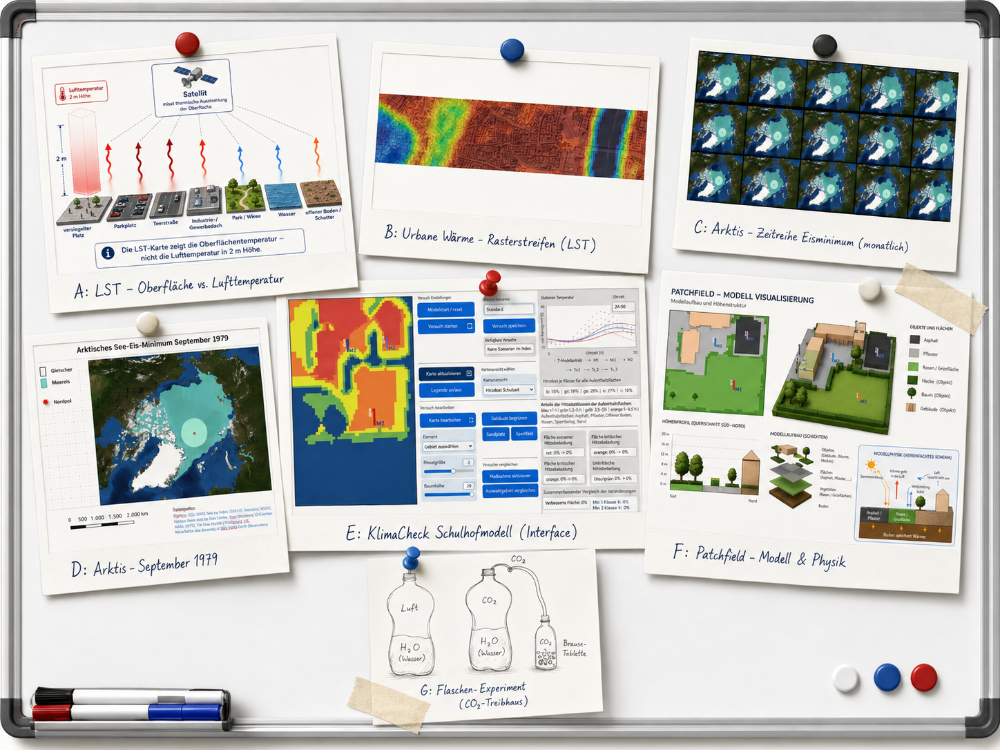

# Willkommen in der KlimaResilienzSchule des Schülerlabors

Die **KlimaResilienzSchule** ist ein Angebot der **AG Geographiedidaktik – Schwerpunkt Physische Geographie** an der Universität zu Köln unter Leitung von **Jun.-Prof. Dr. Rieke Ammoneit**.

Sie bietet Lehrkräften einen Zugang zu Klimawandel, Klimaresilienz und wissenschaftlichem Arbeiten, der im Unterricht praktisch nutzbar ist. Die Materialien verbinden Stationenlernen, analoge Experimente, digitale Modelle, Karten, Messdaten und Reflexionsaufgaben. Schülerinnen und Schüler bearbeiten konkrete Klimaphänomene und lernen dabei, wie Aussagen über Klimawandel entstehen, geprüft und begründet werden.

## Klimawandel verstehen – aber wie eigentlich?

Dass sich die Erde menschengemacht rasant erwärmt, ist wissenschaftlich sehr gut belegt. Im öffentlichen Raum werden diese Befunde trotzdem immer wieder infrage gestellt. Daraus ergeben sich für Schule zwei zentrale Aufgaben: Klimawandel fachlich verständlich machen und -vielleicht wichtiger- zu zeigen, wie verlässliches Wissen entsteht.

Die _KlimaResilienzSchule_ setzt dort an, wo Klimawandel im Schulumfeld sichtbar und untersuchbar wird: auf heißen Asphaltflächen, an sonnenexponierten Fassaden, unter Bäumen, auf hellen und dunklen Materialien und in unterschiedlich gestalteten Stadträumen. Treibhauseffekt, Eis-Albedo-Rückkopplung, Stadtklima und Hitzebelastung werden dabei nicht als isolierte Fachbegriffe behandelt, sondern über konkrete Messungen, Karten, Modelle und Gestaltungsfragen erschlossen. Die Schüler*innen arbeiten mit Daten, vergleichen Situationen und leiten daraus ab, welche Maßnahmen lokal wirksam sein können.

## Stationslernen mit kritischer Reflexion von KI-gestütztem Lernen

Im Schülerlabor werden Klimawandel und KI-gestütztes Lernen gemeinsam bearbeitet. Die fachliche Arbeit an den Stationen steht im Mittelpunkt. Parallel dazu wird sichtbar, wann KI beim Strukturieren, Vergleichen und Erklären unterstützt und wann sie eigenes Verstehen verkürzt.

Die Schüler*innen arbeiten abwechselnd mit und ohne KI-Unterstützung. Dadurch werden Unterschiede im Arbeitsprozess, im Verständnis und in der Ergebnisqualität direkt vergleichbar. Am Ende stehen fachliche Ergebnisse und eine Reflexion der Lernwege: Welche Aufgabe konnte durch KI besser erschlossen werden? Wo war eigenes Nachdenken entscheidend? Welche Antwort musste überprüft, begründet oder korrigiert werden?

## Ablauf

Nach einer kurzen Einführung bearbeiten die Schüler*innen mehrere Stationen zu Klimawandel, Klimaresilienz und wissenschaftlichem Arbeiten. Die Stationen kombinieren Experimente, digitale Modelle, Kartenarbeit und Auswertung. Einzelne Bausteine können auch unabhängig voneinander im Unterricht eingesetzt werden.

Der gemeinsame Kern aller Stationen ist die Übersetzung von Klimawissen in konkrete Unterrichtshandlungen: ein Phänomen untersuchen, eine Methode nutzen, Ergebnisse vergleichen und die Aussagekraft prüfen. Dadurch entsteht ein Zugang, der fachliches Lernen, räumliches Denken und reflektierten Umgang mit KI verbindet.

## Weiterentwicklung

Die KlimaResilienzSchule ist als wachsende Materialstruktur angelegt. Weitere Stationen, Modelle, Aufgaben, Datensätze und Unterrichtsmaterialien können fortlaufend ergänzt werden.

## Lizenz

© 2026 Rieke Ammoneit, Chris Reudenbach

Dieses Material steht unter der Lizenz **Creative Commons Attribution 4.0 International (CC BY 4.0)**. Es darf geteilt und bearbeitet werden, solange die Urheber*innen genannt werden.
